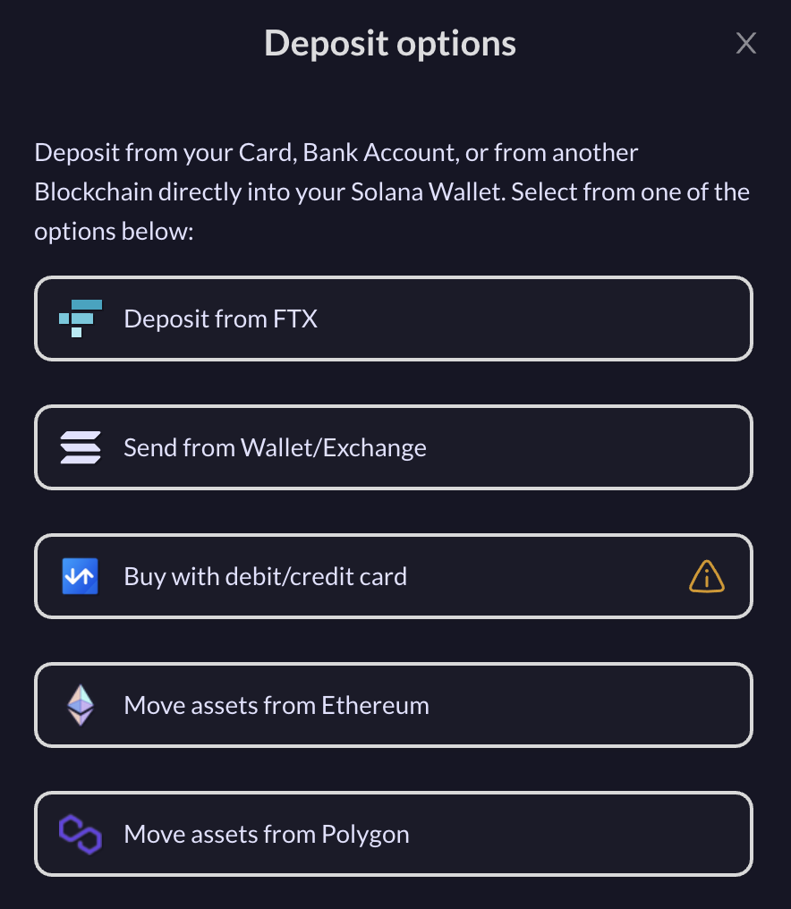

# Deposits

### Deposits

Using MeanFi to deposit your fiat money in MeanFi is simple and straightforward. You can make deposits using your Credit/Debit Card, Bank Accounts (SEPA), or from another Blockchain (like Ethereum or Polygon) directly into your Solana wallet. 

All these options will be available via menu item > **Deposits. **

See below the steps on how to make deposits into your wallet using different onramp options.


To make sure you have all the options available, you must connect your **Solana** **Wallet** first. It is required for the onramp options. 


**Deposit from FTX**

1. **Select **option** **>** Deposit from FTX**
2. If you have already an Account with FTX you will be prompt to login, and then enter the amount that you would like to transfer into your wallet. 
3. If you do not have an Account with FTX you will be able to create one right there.
4. Once FTX approves your funds, you will see them available in your wallet. _FTX usually takes a few mins to approve your transaction. For more about FTX click _[_here_](https://ftx.com/en)_._

**Send from Wallet / Exchange**

1. **Select **option > **Send from Wallet / Exchange**
2. This will prompt you with the Account address, as well as QR code to easily scan from another wallet to make a deposit into your **Solana wallet. **

**Move Assets from Ethereum or Polygon**

1. **Select **one of the options: **Move Assets from Etherium / Polygon**
2. This will connect you with [AllBridge](https://app.allbridge.io) which is a bridge that allows you to move assets between blockchains. Eg: Moving assets from Ethereum into Solana. 
3. The bridge will guide you thru the steps to follow to successfully move your assets. _For more about Allbridge click _[_here_](https://allbridge.io)_. _

### ****
