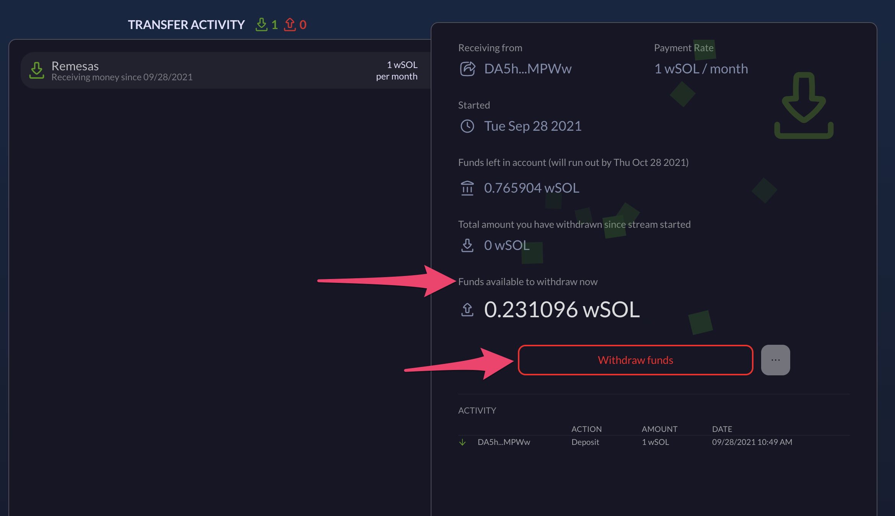

# Withdrawals

### **Withdrawals (for Transfers)**

When you are the recipient of a transfer, you'll see the incoming transfers under the Transfers tab. The amount available for withdrawal is shown in the transfer details.

When you are ready to withdraw, simply click on the "Withdraw funds" button, and specify the amount. After the withdrawal is confirmed in your wallet, the money will show up under the corresponding account.
